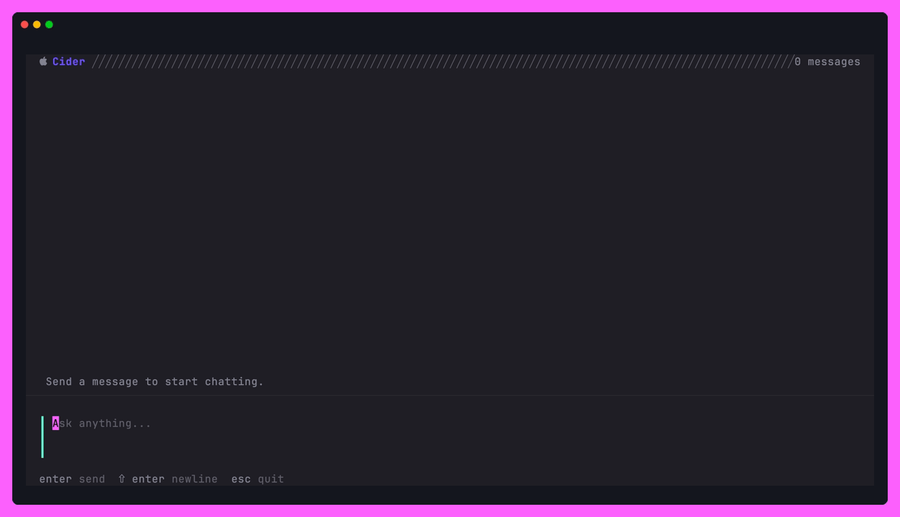
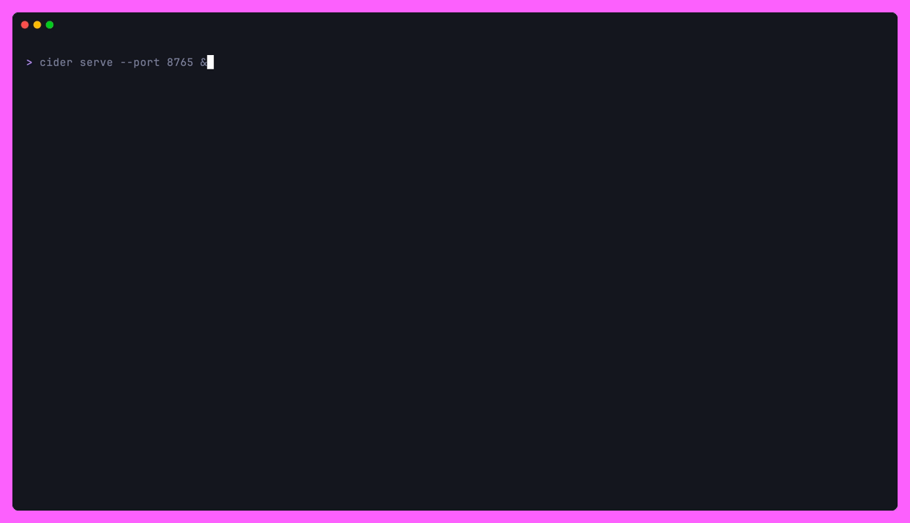
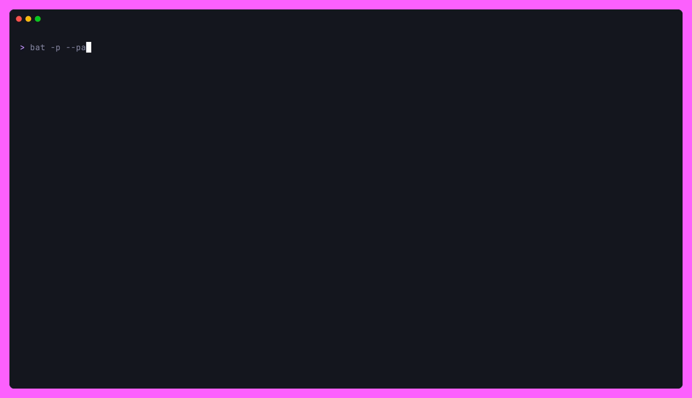

<div align="center">
  <h1>cider</h1>
  <p>Apple Foundation Models, in Go. On-device, private, no cgo.</p>

  <a href="https://github.com/Gaurav-Gosain/cider/releases"></a>
  <a href="https://pkg.go.dev/github.com/Gaurav-Gosain/cider?tab=doc"></a>
  <a href="LICENSE"></a>
  
</div>

<p align="center">
  
</p>

cider is a Go binding for Apple's on-device Foundation Models, plus a
small toolkit on top: a chat TUI, an OpenAI-compatible HTTP server,
type-safe tool calling, and structured extraction driven by Go struct
tags. Everything runs locally against the model that ships with macOS
26+. No API keys, no network.

The binding goes through a thin Swift C ABI loaded via
[purego](https://github.com/ebitengine/purego), so a single
`go build -tags=" "` (no cgo) produces the binary.

<details>
<summary>Table of Contents</summary>

- [Quickstart](#quickstart)
- [The chat TUI](#the-chat-tui)
- [OpenAI-compatible server](#openai-compatible-server)
- [Library API](#library-api)
  - [Streaming](#streaming)
  - [Structured extraction](#structured-extraction)
  - [Tool calling](#tool-calling)
- [Requirements](#requirements)
- [Building from source](#building-from-source)
- [Examples](#examples)
- [Architecture](#architecture)
- [Regenerating the GIFs](#regenerating-the-gifs)
- [Attribution](#attribution)
- [License](#license)

</details>

## Quickstart

```sh
# Install
brew install Gaurav-Gosain/tap/cider          # macOS
go install github.com/Gaurav-Gosain/cider@latest

# Chat with the on-device model
cider

# Or run an OpenAI-compatible server on :8080
cider serve
```

cider always ships the Foundation Models dylib alongside the binary.
The `go install` path requires the [build-from-source](#building-from-source)
steps because the dylib has to be compiled with Swift on macOS 26+.

## The chat TUI

Run `cider` with no arguments and you get a [bubbletea
v2](https://github.com/charmbracelet/bubbletea) chat with live
markdown rendering, a glitch spinner while the model thinks, and the
full transcript scrollable in-place. `--instructions` sets a system
prompt; `--verbose` exposes debug logs.

```sh
cider
cider --instructions "You are a terse pirate."
```

| Key | Action |
|-----|--------|
| `enter` | Send |
| `shift+enter` / `ctrl+j` | Newline in the editor |
| `esc` | Cancel an in-flight response, or quit when idle |
| `pgup` / `pgdown` | Scroll the transcript |
| `ctrl+c` | Quit |

## OpenAI-compatible server

`cider serve` exposes the on-device model at the OpenAI Chat
Completions surface so any existing OpenAI SDK or CLI works against
it. Streaming, tool-calling, and `/v1/models` are all wired up.

<p align="center">
  
</p>

```sh
cider serve --port 8080
# routes:
#   GET  /v1/models
#   POST /v1/chat/completions   (streaming + non-streaming, with optional tools)
#   GET  /health
```

Drive it with anything OpenAI-shaped:

```sh
# Streaming with curl, rendered live through streamd
curl -sN http://127.0.0.1:8080/v1/chat/completions \
  -H 'Content-Type: application/json' \
  -d '{"model":"apple-on-device-fm","stream":true,"messages":[
        {"role":"user","content":"Explain quicksort in two paragraphs."}]}' \
  | streamd

# OpenAI Python SDK against the local model
python - <<'PY'
from openai import OpenAI
client = OpenAI(base_url="http://127.0.0.1:8080/v1", api_key="not-needed")
for ev in client.chat.completions.create(
    model="apple-on-device-fm",
    messages=[{"role": "user", "content": "Hello"}],
    stream=True,
):
    print(ev.choices[0].delta.content or "", end="", flush=True)
PY
```

Pass `--api-key` to require `Authorization: Bearer …` on every
request. `--instructions` becomes the default system prompt when the
client doesn't send one.

## Library API

Add cider to a Go module and talk to the model directly:

```go
import "github.com/Gaurav-Gosain/cider/pkg/fm"

fm.Init()                                    // load libFoundationModels.dylib
session, _ := fm.NewSession(
    fm.WithInstructions("You are concise."),
)
defer session.Close()

reply, _ := session.Respond(ctx, "Hello in one sentence.")
```

`fm.NewSession` accepts `WithInstructions`, `WithModel`, and
`WithTools`. `Respond` returns the full response; the streaming
variant is below. Both take optional `fm.GenerationOptions{Temperature, MaxTokens}`.

### Streaming

<p align="center">
  
</p>

```go
chunkCh, errCh := session.StreamResponse(ctx,
    "Tell me a very short story about a robot learning to paint.")

var prev string
for chunk := range chunkCh {
    // FM streams cumulative snapshots; print only the new tail.
    if len(chunk) > len(prev) {
        fmt.Print(chunk[len(prev):])
    }
    prev = chunk
}
if err := <-errCh; err != nil { /* ... */ }
```

The chunks are full snapshots, not deltas, so you take the suffix.
`cider serve` does the same conversion when emitting OpenAI-style SSE.

### Structured extraction

<p align="center">
  
</p>

`fm.SchemaFor[T]()` builds an Apple `GenerationSchema` from struct
tags: `json` for the property name, `description` for the prompt-side
hint, `enum:"a,b,c"` for `anyOf` constraints, `,omitempty` for
optional. `fm.Extract` chains schema + respond + unmarshal in one
call.

```go
type Sentiment struct {
    Score float64 `json:"score" description:"Sentiment score from -1.0 to 1.0"`
    Label string  `json:"label" description:"Sentiment label" enum:"positive,negative,neutral"`
}

var out Sentiment
err := fm.Extract(ctx, session, "I absolutely love this product!", &out)
// out.Label == "positive", out.Score ~ 1.0
```

For richer schemas (numeric ranges, regex, item counts) hand-build
with `fm.NewGenerationSchema` + `fm.NewProperty` and call
`AddRangeGuide`, `AddRegexGuide`, `AddMin/MaxItemsGuide`, etc. See
[`pkg/fm/schema.go`](pkg/fm/schema.go).

### Tool calling

<p align="center">
  
</p>

`fm.FuncTool[T]` lifts any Go function into an FM-callable tool. The
schema is generated from `T`, the model picks the arguments, and your
function gets called with a typed struct.

```go
type CalculatorArgs struct {
    Op string  `json:"op" description:"Operation" enum:"add,subtract,multiply,divide"`
    A  float64 `json:"a"  description:"First number"`
    B  float64 `json:"b"  description:"Second number"`
}

calc := fm.FuncTool("calculator", "Performs basic arithmetic",
    func(args CalculatorArgs) (string, error) { /* ... */ })

session, _ := fm.NewSession(
    fm.WithInstructions("Use the calculator for arithmetic."),
    fm.WithTools(calc),
)
reply, _ := session.Respond(ctx, "What is 42 * 17?")
```

For full control, implement the `fm.Tool` interface yourself
(`Name`, `Description`, `ArgumentsSchema`, `Call`).

## Requirements

- macOS 26+ on Apple silicon. Apple Intelligence must be enabled in
  System Settings → Apple Intelligence & Siri.
- Go 1.25+ to build the bindings.
- Swift 6.2+ to build `libFoundationModels.dylib` from the C bindings.

`fm.Init()` returns `model unavailable: …` with a specific reason
(Apple Intelligence not enabled, device not eligible, model not
ready) when the prerequisites aren't met.

## Building from source

```sh
git clone https://github.com/Gaurav-Gosain/cider.git
cd cider

make build           # swift build + go build -> bin/cider
make run             # build + cider serve
make examples        # run every example end-to-end
```

The Swift bindings produce
`foundation-models-c/.build/arm64-apple-macosx/release/libFoundationModels.dylib`.
At runtime cider looks for the dylib in this order:

1. `$CIDER_LIB_PATH/libFoundationModels.dylib`
2. The directory containing the `cider` binary
3. `./foundation-models-c/.build/arm64-apple-macosx/release/`
4. Anything reachable through `DYLD_LIBRARY_PATH`

So you can either install the dylib next to the binary, point
`DYLD_LIBRARY_PATH` at it, or set `CIDER_LIB_PATH`.

## Examples

Each runnable demo lives in [`examples/`](examples/). They all need
`DYLD_LIBRARY_PATH` set or the dylib next to the binary; `make
examples` does it for you.

| Path | What it shows |
|------|---------------|
| [`examples/basic`](examples/basic/main.go) | Init, availability check, single `Respond` |
| [`examples/streaming`](examples/streaming/main.go) | Token-by-token streaming with cumulative-to-delta conversion |
| [`examples/multiturn`](examples/multiturn/main.go) | Long-running session, transcript JSON access |
| [`examples/structured`](examples/structured/main.go) | `SchemaFor[T]` + `RespondWithSchema` + `Unmarshal` |
| [`examples/extract`](examples/extract/main.go) | One-line `fm.Extract[T]` shortcut |
| [`examples/tool`](examples/tool/main.go) | `fm.FuncTool[T]` with a calculator |

## Architecture

```
main.go                  cider entry point, wired via charm.land/fang
cmd/                     cobra command tree (root TUI, `serve`)
internal/tui/            bubbletea v2 chat: model + styles + spinner + glamour
internal/server/         echo v5 HTTP server, OpenAI-compatible types + handlers + proxy tools
pkg/fm/                  the Go binding surface (Init, Session, Schema, Tool, Extract)
foundation-models-c/     Swift package exporting a C ABI; builds libFoundationModels.dylib
python-apple-fm-sdk/     upstream Python reference (Apache 2.0), kept for parity reading only
```

A few details worth knowing:

- The Foundation Models stream emits cumulative snapshots, not
  deltas. cider does the snapshot-to-delta math once in
  `internal/server/handlers.go` for the OpenAI SSE shape, and once in
  `internal/tui/model.go` for live in-place rendering.
- Tool calls hop the C ABI through `purego.NewCallback`. Each
  `BridgedTool` owns its own callback so dispatch is per-tool, not
  global. The Swift side buffers tool results in a `ToolCallState`
  enum to bridge the synchronous `foreignCall` against an async
  continuation.
- Server-side OpenAI tool-calling is implemented as proxy tools that
  cancel the generation context the moment the model decides to call
  one, so `tool_calls` get returned to the client instead of being
  executed locally.

## Regenerating the GIFs

The demos above are produced by [VHS](https://github.com/charmbracelet/vhs).
See [`vhs/`](vhs/) for the tape files.

```sh
make -C vhs               # rebuild every gif (also rebuilds binaries)
make -C vhs gif-chat      # one at a time
make -C vhs clean         # drop generated gifs
```

## Attribution

- [foundation-models-framework](https://github.com/apple/foundation-models-framework)
  by Apple (Apache 2.0). The Swift sources under
  [`foundation-models-c/`](foundation-models-c/) are derived from
  Apple's reference C bindings; the Python SDK kept under
  [`python-apple-fm-sdk/`](python-apple-fm-sdk/) is the upstream
  Python binding, included for parity reading only.
- [purego](https://github.com/ebitengine/purego) (Apache 2.0) for the
  cgo-free C ABI loader.
- [Charm](https://charm.sh) ecosystem: bubbletea v2, bubbles v2,
  lipgloss v2, fang v2, log v2, glamour.
- [echo](https://github.com/labstack/echo) v5 for the HTTP server.
- The chat TUI's role-prefixed message layout and gradient glitch
  spinner are inspired by [crush](https://github.com/charmbracelet/crush);
  the implementation here is independent.

## License

MIT. See [LICENSE](LICENSE).
